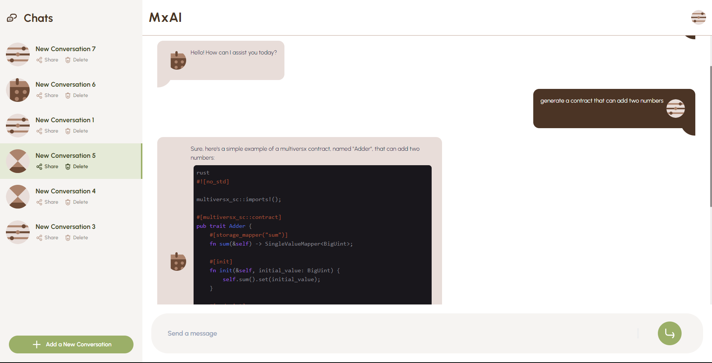
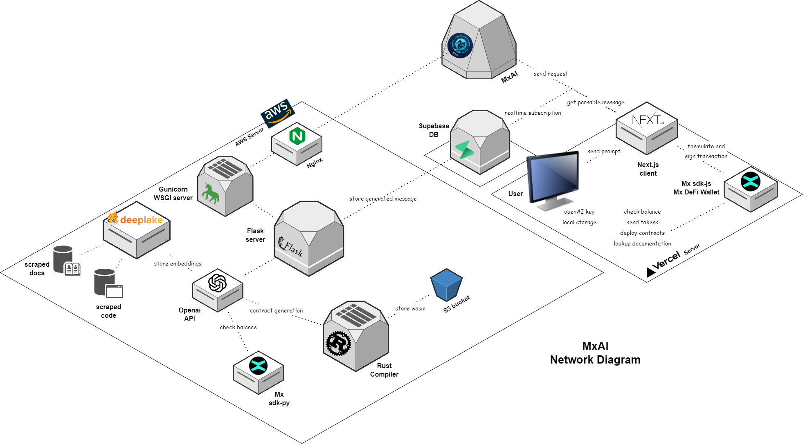

<!-- Improved compatibility of back to top link: See: https://github.com/CommanderAstern/encode-multiversX/pull/73 -->
<a name="readme-top"></a>
<!--
*** Thanks for checking out the encode-multiversX. If you have a suggestion
*** that would make this better, please fork the repo and create a pull request
*** or simply open an issue with the tag "enhancement".
*** Don't forget to give the project a star!
*** Thanks again! Now go create something AMAZING! :D
-->


<!-- PROJECT SHIELDS -->
<!--
*** I'm using markdown "reference style" links for readability.
*** Reference links are enclosed in brackets [ ] instead of parentheses ( ).
*** See the bottom of this document for the declaration of the reference variables
*** for contributors-url, forks-url, etc. This is an optional, concise syntax you may use.
*** https://www.markdownguide.org/basic-syntax/#reference-style-links
-->
[![Contributors][contributors-shield]][contributors-url]
[![Forks][forks-shield]][forks-url]
[![Stargazers][stars-shield]][stars-url]
[![Issues][issues-shield]][issues-url]
[![MIT License][license-shield]][license-url]


<!-- PROJECT LOGO -->
<br />
<div align="center">
  <a href="https://github.com/CommanderAstern/encode-multiversX">
    
  </a>

  <h3 align="center">MxAI</h3>

  <p align="center">
    Simplifying blockchain interaction for everyone!
    <br />
    <a href="https://github.com/CommanderAstern/encode-multiversX"><strong>Explore the docs »</strong></a>
    <br />
    <br />
    <a href="https://github.com/CommanderAstern/encode-multiversX">View Demo</a>
    ·
    <a href="https://github.com/CommanderAstern/encode-multiversX/issues">Report Bug</a>
    ·
    <a href="https://github.com/CommanderAstern/encode-multiversX/issues">Request Feature</a>
  </p>
</div>


<!-- TABLE OF CONTENTS -->
<details>
  <summary>Table of Contents</summary>
  <ol>
    <li>
      <a href="#about-the-project">About The Project</a>
      <ul>
        <li><a href="#built-with">Built With</a></li>
      </ul>
    </li>
    <li>
      <a href="#getting-started">Getting Started</a>
      <ul>
        <li><a href="#prerequisites">Prerequisites</a></li>
        <li><a href="#installation">Installation</a></li>
      </ul>
    </li>
    <li><a href="#usage">Usage</a></li>
    <li><a href="#roadmap">Roadmap</a></li>
    <li><a href="#contributing">Contributing</a></li>
    <li><a href="#license">License</a></li>
    <li><a href="#contact">Contact</a></li>
    <li><a href="#acknowledgments">Acknowledgments</a></li>
  </ol>
</details>


<!-- ABOUT THE PROJECT -->
## About The Project



MxAI is a user-friendly chatbot designed to simplify and democratize blockchain technology. It reduces the steep learning curve for newcomers by providing an AI-driven interface that requires minimal technical expertise, while also streamlining repetitive and time-consuming processes for technical users. Our chatbot aims to make web3 accessible to everyone, contributing to the widespread adoption of blockchain technology.

Current features include:
* Generate, compile, and deploy code for blockchain applications
* Interact with ERC20 contracts
* Perform operations such as sending tokens and viewing balances of accounts
* Lookup Multiversx Documentation for guidance and information

<p align="right">(<a href="#readme-top">back to top</a>)</p>


### Built With



* [](https://nextjs.org/)
* [](https://tailwindcss.com/)
* [](https://supabase.com/)
* [](https://openai.com/blog/openai-api)
* [](https://www.nginx.com/)
* [](https://gunicorn.org/)
* [](https://flask.palletsprojects.com/en/3.0.x/)
* [](https://aws.amazon.com/)
* [](https://www.langchain.com/)
* [](https://www.deeplake.ai/)
* [](https://multiversx.com/)

We have used the following MultiversX sdks to build the project:
* [sdk-js](https://docs.multiversx.com/sdk-and-tools/sdk-js)
  * The wallet extension provider enables users to authenticate their MultiversX DeFi Wallet and authorize transactions.
  * Network providers to interact with the network and broadcast the transactions.
  * Utilized Code, SmartContract, and CodeMetadata classes to deploy smart contracts from hosted .wasm files.
  * ABI Registry to interact with smart contracts from hosted abi files.
* [sdk-py](https://docs.multiversx.com/sdk-and-tools/sdk-py/)
  * Query details about accounts such as balance, nonce etc.
* [mx-sdk-rs](https://github.com/multiversx/mx-sdk-rs)
  * Use the library to compile the generated contracts
* [Multiversx Defi Wallet Extension](https://chrome.google.com/webstore/detail/multiversx-defi-wallet/dngmlblcodfobpdpecaadgfbcggfjfnm)
<p align="right">(<a href="#readme-top">back to top</a>)</p>


<!-- GETTING STARTED -->
## Getting Started

This is an example of how you may give instructions on setting up your project locally.
To get a local copy up and running follow these simple example steps.

### Prerequisites

This is an example of how to list things you need to use the software and how to install them.
* npm
  ```sh
  npm install npm@latest -g
  ```

### Installation

#### Frontend

1. Set up Supabase:

    1.1. Visit [Supabase](https://supabase.com/) and sign up for an account if you don’t already have one.

    1.2. After signing up and logging in, create a new project.

    1.3. Once your project is created, navigate to the 'API' section. Here, you will find your API keys: `supabaseUrl` and `anonKey`.

    1.4. Note down these keys. You'll be needing them in subsequent steps.

2. Clone the Repository:

    Open your terminal or command prompt and execute the following commands:

    ```sh
    git clone https://github.com/CommanderAstern/encode-multiversX.git
    ```

    This will clone the repository into a directory named "encode-multiversX".

3. Install Necessary NPM Packages:

    Before installing the packages, ensure you have [Node.js](https://nodejs.org/) and [NPM](https://www.npmjs.com/) installed on your machine.

    Now, navigate to the frontend directory:

    ```sh
    cd encode-multiversX/frontend
    ```

    Install the required packages:

    ```sh
    npm install
    ```

4. Configure Environment Variables:

    4.1. In the `frontend` directory, create an `.env.local` file.

    4.2. Open `.env.local` in a text editor.

    4.3. Add the following environment variables with the values that you obtained from the Supabase dashboard:

    ```sh
    NEXT_PUBLIC_SUPABASE_URL=your_supabase_url
    NEXT_PUBLIC_SUPABASE_ANON_KEY=your_anon_key
    ```

    Replace `your_supabase_url` and `your_anon_key` with the appropriate values.

    4.4. Specify Your Backend's URL:

    Specify the URL where your backend is currently running.

    Open the `.env.local` file and add the following:

    ```sh
    NEXT_PUBLIC_BASE_URL=http://localhost:5000
    ```

    In the above example, the backend is assumed to be running locally on port `5000`. Replace `http://localhost:5000` with the actual URL where your backend is running.

    4.5. Save and close the `.env.local` file.

5. Run the Application:

    If you're ready to see your project in action, you can start the development server:

    ```sh
    npm run dev
    ```

    Visit `http://localhost:3000` in your browser to see the application running.

<p align="right">(<a href="#readme-top">back to top</a>)</p>

<!-- USAGE EXAMPLES -->
## Usage

#### Step 1: Create an Account

1. Open your web browser and navigate to: 
```
http://mxai.live/signup
```

2. Follow the on-screen instructions to create an account.

#### Step 2: Configure OpenAI API Key

1. After logging in, look for a user icon or profile picture on the top right corner of the web page.

2. Click on it. A modal (popup window) will appear.

3. Within this modal, you'll find an input field to add your OpenAI API key. Paste your OpenAI API key into the designated field.

4. Save to ensure your key is stored.

#### Step 3: Set Up MultiversX Wallet Extension

Before proceeding, ensure you have the MultiversX Wallet browser extension:

1. If you haven't installed the MultiversX Wallet extension, download and install it from the respective browser's extension store.

2. Once installed, click on the MultiversX Wallet icon in your browser's toolbar.

3. Log in or set up your wallet account.

#### Step 4: Start Typing!

With everything set up, you're ready to interact with the application. Start typing in the designated area, and watch as the magic happens!

---

#### Sample Prompts:

- I would like to send a transaction of 1000 to erd1877ppafpazuwgjcnr02rdhnn8ux53xlwvvr0aexww3fdlt07ch4sufuv5c
- What is the balance of erd1877ppafpazuwgjcnr02rdhnn8ux53xlwvvr0aexww3fdlt07ch4sufuv5c
- Can you generate a contract that let's you add two numbers and also holds the number 8 which you can increment it?
- Can you tell me about the extension wallet provider in multiversX?
- I'd like to interact with an ERC20 contract at address erd1qqqqqqqqqqqqqpgqdjfrylk03uvwlqc2t3l8ymwelev3zmw3wdtqqy0fzc


<p align="right">(<a href="#readme-top">back to top</a>)</p>


<!-- ROADMAP -->
## Roadmap

- [x] Add Changelog
- [x] Add back to top links
- [ ] Add Additional Templates w/ Examples
- [ ] Add "components" document to easily copy & paste sections of the readme
- [ ] Multi-language Support
    - [ ] Chinese
    - [ ] Spanish

See the [open issues](https://github.com/CommanderAstern/encode-multiversX/issues) for a full list of proposed features (and known issues).

<p align="right">(<a href="#readme-top">back to top</a>)</p>


<!-- CONTRIBUTING -->
## Contributing

Contributions are what make the open source community such an amazing place to learn, inspire, and create. Any contributions you make are **greatly appreciated**.

If you have a suggestion that would make this better, please fork the repo and create a pull request. You can also simply open an issue with the tag "enhancement".
Don't forget to give the project a star! Thanks again!

1. Fork the Project
2. Create your Feature Branch (`git checkout -b feature/AmazingFeature`)
3. Commit your Changes (`git commit -m 'Add some AmazingFeature'`)
4. Push to the Branch (`git push origin feature/AmazingFeature`)
5. Open a Pull Request

<p align="right">(<a href="#readme-top">back to top</a>)</p>


<!-- LICENSE -->
## License

Distributed under the MIT License. See `LICENSE.txt` for more information.

<p align="right">(<a href="#readme-top">back to top</a>)</p>


<!-- CONTACT -->
## Contact

Pratik Jallan - [Linkedin](https://www.linkedin.com/in/pratik-jallan/) - pratikjalan11@gmail.com

Malavika Harikumar - [Linkedin](https://www.linkedin.com/in/malavika-harikumar-here/) - malavikaha02@gmail.com

Asim Jawahir - [Linkedin](https://www.linkedin.com/in/asimjawahir/) - asimjawahir123@gmail.com

Project Link: [https://github.com/CommanderAstern/encode-multiversX](https://github.com/CommanderAstern/encode-multiversX)

<p align="right">(<a href="#readme-top">back to top</a>)</p>


<!-- ACKNOWLEDGMENTS -->
## Acknowledgments


<p align="right">(<a href="#readme-top">back to top</a>)</p>


<!-- MARKDOWN LINKS & IMAGES -->
<!-- https://www.markdownguide.org/basic-syntax/#reference-style-links -->
[contributors-shield]: https://img.shields.io/github/contributors/CommanderAstern/encode-multiversX.svg?style=for-the-badge
[contributors-url]: https://github.com/CommanderAstern/encode-multiversX/graphs/contributors
[forks-shield]: https://img.shields.io/github/forks/CommanderAstern/encode-multiversX.svg?style=for-the-badge
[forks-url]: https://github.com/CommanderAstern/encode-multiversX/network/members
[stars-shield]: https://img.shields.io/github/stars/CommanderAstern/encode-multiversX.svg?style=for-the-badge
[stars-url]: https://github.com/CommanderAstern/encode-multiversX/stargazers
[issues-shield]: https://img.shields.io/github/issues/CommanderAstern/encode-multiversX.svg?style=for-the-badge
[issues-url]: https://github.com/CommanderAstern/encode-multiversX/issues
[license-shield]: https://img.shields.io/github/license/CommanderAstern/encode-multiversX.svg?style=for-the-badge
[license-url]: https://github.com/CommanderAstern/encode-multiversX/blob/master/LICENSE.txt
[linkedin-shield]: https://img.shields.io/badge/-LinkedIn-black.svg?style=for-the-badge&logo=linkedin&colorB=555
[linkedin-url]: https://linkedin.com/in/CommanderAstern
[product-screenshot]: images/screenshot.png
[Next.js]: https://img.shields.io/badge/next.js-000000?style=for-the-badge&logo=nextdotjs&logoColor=white
[Next-url]: https://nextjs.org/
[React.js]: https://img.shields.io/badge/React-20232A?style=for-the-badge&logo=react&logoColor=61DAFB
[React-url]: https://reactjs.org/
[Vue.js]: https://img.shields.io/badge/Vue.js-35495E?style=for-the-badge&logo=vuedotjs&logoColor=4FC08D
[Vue-url]: https://vuejs.org/
[Angular.io]: https://img.shields.io/badge/Angular-DD0031?style=for-the-badge&logo=angular&logoColor=white
[Angular-url]: https://angular.io/
[Svelte.dev]: https://img.shields.io/badge/Svelte-4A4A55?style=for-the-badge&logo=svelte&logoColor=FF3E00
[Svelte-url]: https://svelte.dev/
[Laravel.com]: https://img.shields.io/badge/Laravel-FF2D20?style=for-the-badge&logo=laravel&logoColor=white
[Laravel-url]: https://laravel.com
[Bootstrap.com]: https://img.shields.io/badge/Bootstrap-563D7C?style=for-the-badge&logo=bootstrap&logoColor=white
[Bootstrap-url]: https://getbootstrap.com
[JQuery.com]: https://img.shields.io/badge/jQuery-0769AD?style=for-the-badge&logo=jquery&logoColor=white
[JQuery-url]: https://jquery.com 